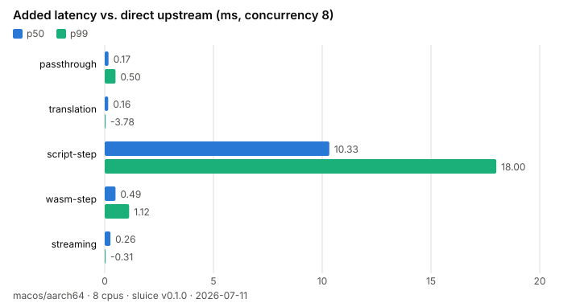

# Benchmarks

End-to-end overhead of putting sluice between a client and an LLM
upstream, measured against a simulated upstream (2ms time-to-first-token,
1ms inter-chunk, 20 SSE chunks) so runs are deterministic and offline.
Each scenario is measured twice — direct to the upstream (baseline) and
through sluice — and the numbers reported are the *added* latency.

<picture>
  <source media="(prefers-color-scheme: dark)" srcset="assets/chart-dark.svg">
  
</picture>

## Running

```
cargo run --release -p sluice-bench            # full run (~3 min)
cargo run --release -p sluice-bench -- --quick # smoke run (~20 s)
```

Results land in `results/latest.json` (machine, sluice version, date, and
the full matrix) and the charts above are re-rendered on every run. The
committed numbers come from the machine and version labeled inside the
chart and JSON — treat cross-machine comparisons as directional only.

## Scenarios

- **passthrough** — plain proxy route, no steps
- **translation** — openai→anthropic wire translation
- **script-step** — a oneshot subprocess step in the request chain (unix only)
- **wasm-step** — a wasmtime guest step in the request chain
- **streaming** — SSE passthrough; also reports time-to-first-byte

Concurrency levels 1 / 8 / 64; nearest-rank percentiles over a 5s window
after a 2s warmup. Not run in CI — shared-runner numbers are noise.
